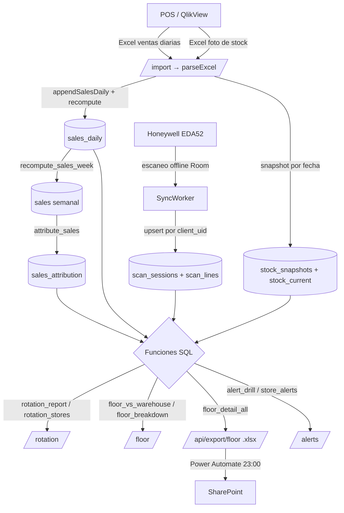

# Estado del sistema — Rack One (fuente de verdad)

> Documento índice para levantar contexto rápido y no perder congruencia.
> Mantener actualizado al agregar features. Ver también `REPORTES_Y_RPC.md`
> (catálogo de funciones SQL) y `LECCIONES_Y_GOTCHAS.md` (bugs resueltos y reglas
> a no romper). Reglas de negocio canónicas en `CLAUDE.md`.

Cliente: **Lukers** (Perú, ~10 tiendas). Objetivo: medir **rotación y venta por
mueble/piso de venta**, y saber **dónde está la mercadería** (piso vs almacén).

## Componentes

| Módulo | Stack | Rol |
|---|---|---|
| `supabase/` | Postgres + RLS + funciones `security definer` | Datos, atribución, métricas, reportes |
| `web/` | Next.js 14 (App Router) + TS | Admin, import, reportes, export |
| `mobile/` | Kotlin + Compose (Honeywell EDA52) | Escaneo offline-first del piso |

Despliegue: **web en Railway**, **backend en Supabase Cloud**, **APK por GitHub
Actions**. Ver `DEPLOY.md`.

## Rutas web (`web/src/app/(dashboard)/`)

| Ruta | Pantalla | Rol | Fuente de datos |
|---|---|---|---|
| `/` | Resumen | todos | varias |
| `/coverage` | Cobertura de escaneo | admin/analista/encargado/visual | `scan_coverage` |
| `/reports` | Reportes (venta por mueble, heatmap, almacén, sin mueble) | admin/analista/encargado | `fixture_week_over_week`, `store_warehouse`, `unattributed_sales` |
| `/rotation` | **Rotación (IRP)** — pestañas Resumen / Por tienda, heatmaps precio/talla | admin/analista/encargado | `rotation_report`, `rotation_stores`, `rotation_filters` |
| `/floor` | **Piso vs Almacén** — por tienda, detalle por dimensión, export CSV | admin/analista/encargado | `floor_vs_warehouse`, `floor_breakdown`, `floor_detail` |
| `/alerts` | **Alertas** — pestañas Drill-down / Operativas | admin/analista/encargado | `alert_drill`, `store_alerts` |
| `/trends` | Tendencias (mueble × semana) | admin/analista/encargado | `fixture_trends` |
| `/monthly` | Proyección mensual por mueble | admin/analista/encargado | `fixture_monthly_metrics` |
| `/import` | Importar ventas diarias y stock (foto) | admin | Server Actions (`import/actions.ts`) |
| `/stores` `/fixtures` `/layout` `/labels` `/calendar` `/store-aliases` `/users` | Mantenimiento | admin/visual/encargado | CRUD directo |
| `/privacidad` | Política de privacidad (Play) | público | — |

API: **`/api/export/floor`** (route handler) — devuelve `.xlsx` del piso de todas
las tiendas, protegido por `EXPORT_TOKEN`. Lo consume Power Automate (export
nocturno a SharePoint). Ver `EXPORT_NOCTURNO.md` (si existe) o sección abajo.

## Flujo de datos (mapa)

Clave transversal: **SKU canónico sin ceros** (normSku al escribir, norm_sku al
leer) para que ventas ↔ stock ↔ escaneo siempre crucen. Ver gotchas #1 y #2.

## Modelo de datos (tablas clave)

- `stores`, `profiles` (rol + `store_id`), `fixtures` (muebles, `barcode`, `floor`).
- `store_aliases` (nombre del archivo POS → tienda Rack One).
- **Ventas**: `sales_daily` (diario del POS: `sale_date`, `sku`, `units`, `amount`,
  `margin`, dims), `sales` (agregado por semana comercial), `sales_attribution`.
- **Stock**: `stock_snapshots` (foto por fecha, con dims: `resp`, `gender`, `mundo`,
  `sap_line`, `article_code`, `talla`, `units`, `value`), `stock_current` (foto
  vigente), `store_stock` (por semana, para almacén deducido).
- **Escaneo**: `scan_sessions` (`store_id`, `fixture_id`, `week`, `scanned_at`,
  `client_uid`, `kind`), `scan_lines` (`session_id`, `sku`, `quantity`; único
  `(session_id, sku)`).
- `weekly_fixture_metrics`, `week_calendar`, `import_logs`, `product_aliases`.

## Reglas de negocio que NO se rompen

1. **SKU = `CODIGO_VARIANTE` sin ceros a la izquierda.** `normSku()` al importar
   (web) y `norm_sku()` **al leer** en las funciones que cruzan escaneo/stock/venta.
   (Ver gotcha #1 — nunca volver a normalizar `scan_lines` al escribir.)
2. **Piso de venta = lo escaneado en los muebles.** Almacén = stock total − piso.
3. **Semana comercial** (domingo→sábado) vía `week_calendar` + `comm_week()`. Tres
   implementaciones deben coincidir: SQL, `web/src/lib/week.ts`, `mobile IsoWeek.kt`.
4. **IRP** = ventas(und) / (ventas + stock) × 100. Proyección por regla de 3
   (días transcurridos). **Margen %** = Σmargen / Σventa × 100.
5. **Atribución de ventas** por SKU exacto al **primer mueble escaneado** de la semana.
6. Operaciones masivas en la web usan **service-role** desde Server Actions.
7. Roles y permisos viven en **RLS**, no en el cliente.

## Flujos principales

- **Carga de ventas** (`/import`): archivo POS con todas las tiendas → se reparte
  por `store_aliases` → agrega por (tienda, sku, fecha) en el navegador → sube por
  lotes (`appendSalesDaily`) → `recompute_sales_range` (semanas + atribución).
- **Carga de stock** (`/import`): foto por fecha → `stock_snapshots` + `stock_current`
  + refresca almacén de la semana. Conserva el cierre de mes.
- **Escaneo** (mobile): sesión por mueble → líneas por SKU (offline Room) →
  `SyncWorker` sube por `client_uid` (idempotente). Refresh de token al 401.
- **Export nocturno**: Power Automate (23:00 Perú) → GET `/api/export/floor?token=…`
  → guarda `.xlsx` en SharePoint. Función `floor_detail_all` (service-role).

## Historial de migraciones relevantes (0030+)

- `0030` margen en rotación · `0031` matrices tienda×talla/precio · `0032`
  `floor_vs_warehouse` · `0033` `sales_loaded_days` (calendario real) · `0034` IRP
  proyectado en heatmaps · `0035` `alert_drill` · `0036–0043` piso/almacén (detalle,
  breakdown, export CSV/JSON, alias) · `0038` normalización SKU (data existente) ·
  `0044` **fix sync**: quita el trigger de normalización y normaliza al leer.
